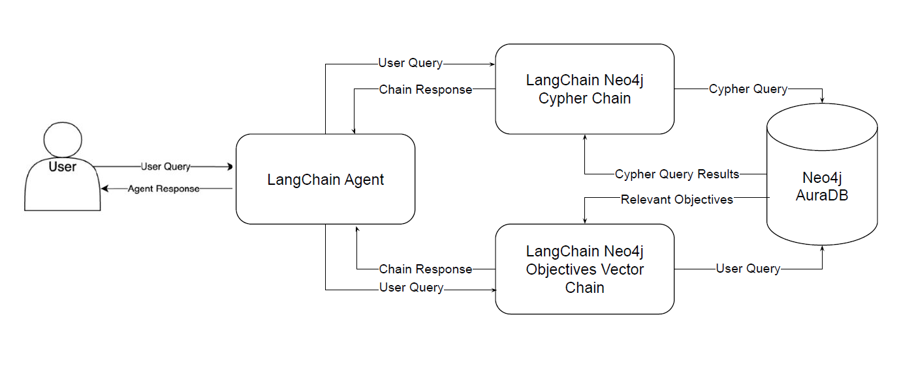
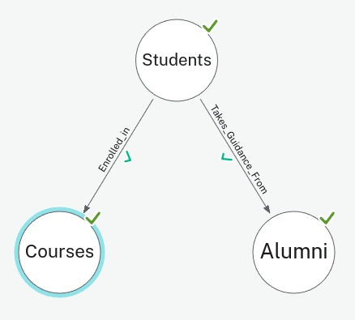
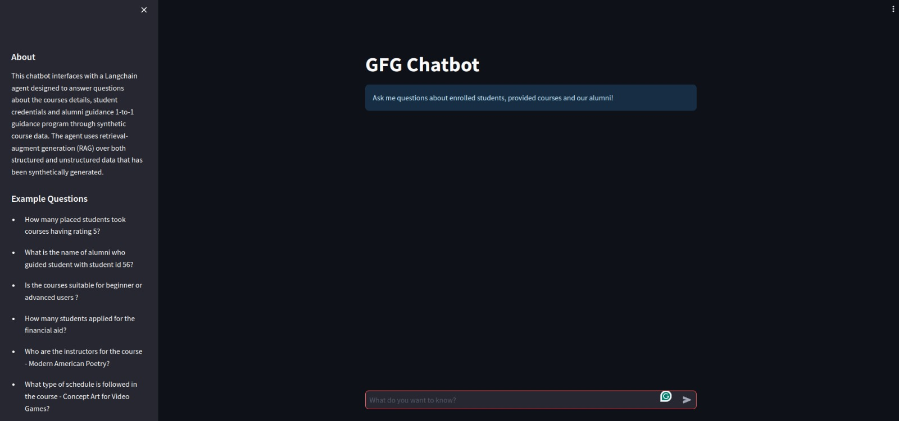
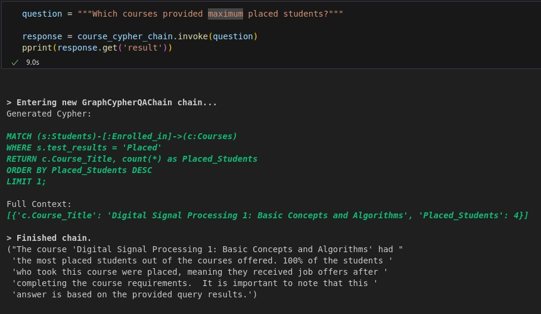
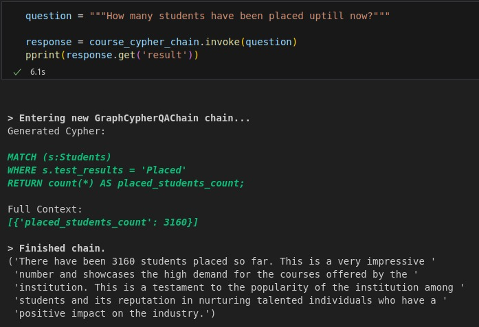

# My Chatbot Project

This is a simple guide to help you get started with running my chatbot project.


## Getting Started

1. Clone this repository to your local machine:

   ```bash
   git clone https://github.com/fantcy-coder/Temp_chat_bot.git
   <!-- running backend api -->
   cd chatbot_api/src/
   uvicorn main:app --reload

   <!--  running front code -->
   cd chatbot_frontend/src/
   streamlit run main.py

### Approach

In this project, I've developed a streamlined approach for both frontend and backend functionalities. For the frontend, I utilized Streamlit, offering a user-friendly interface. On the backend, FastAPI powers the server, ensuring efficient performance. To integrate language modeling capabilities, LangChain facilitates the RAG pipeline implementation. Additionally, Coohere's free API keys enable access to LLM functionalities. This setup ensures seamless interaction between users and the language model, providing a smooth and intuitive experience.

The image below is the pictorial representation of the entire algorithm that has been used:


Entity Relationship Digram between students, cources and alumni is shown below:


The Web Interface used can be seen below:
 

Two sample responses are also attached below:
 
